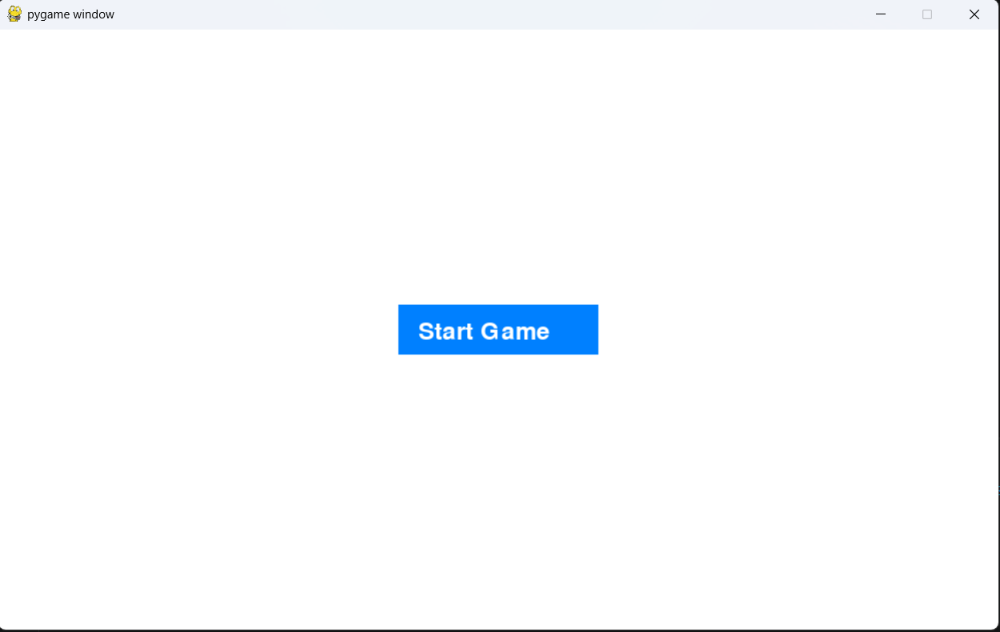
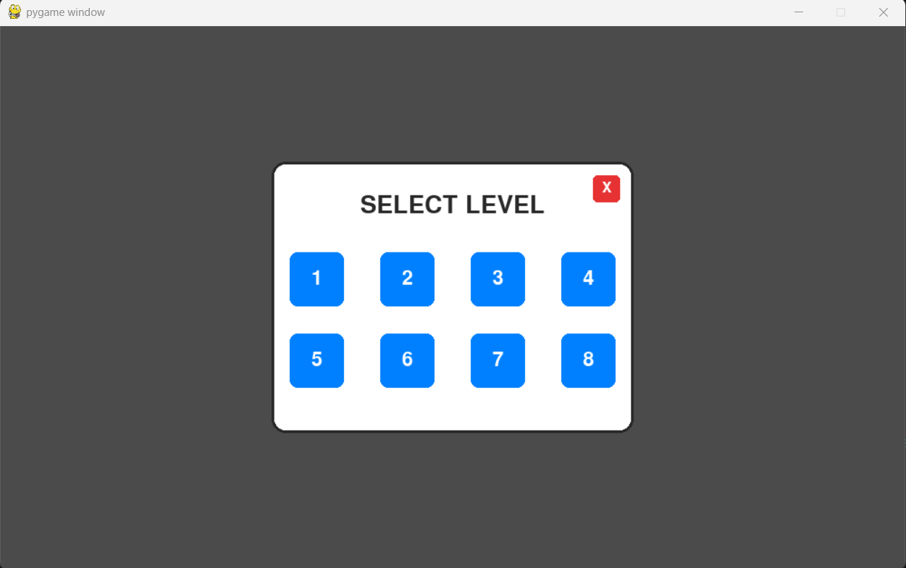
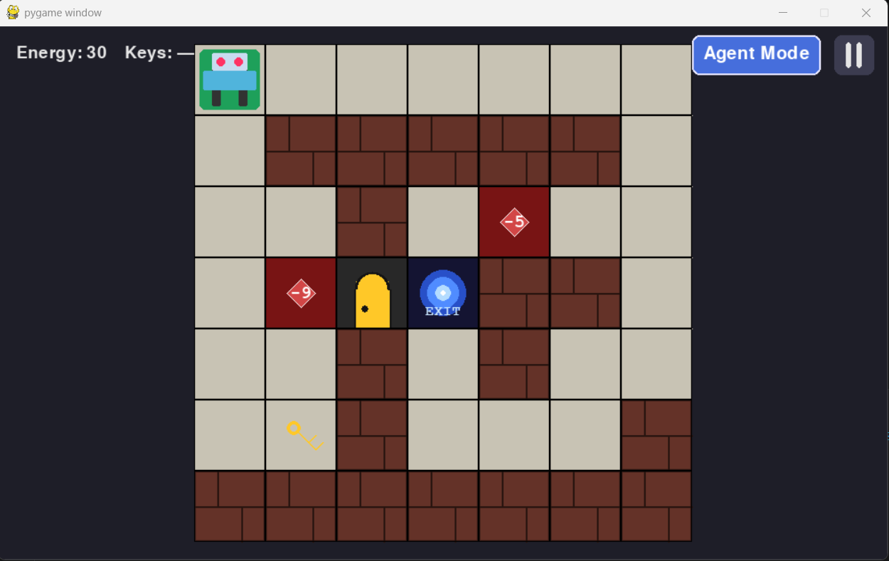
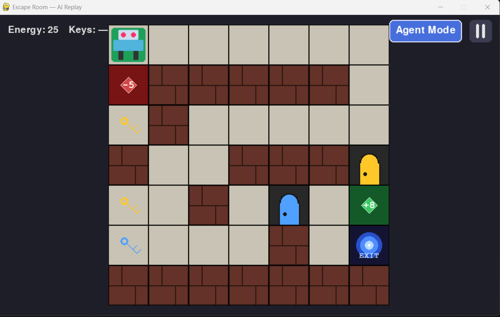
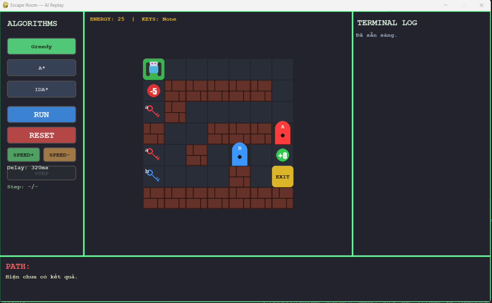
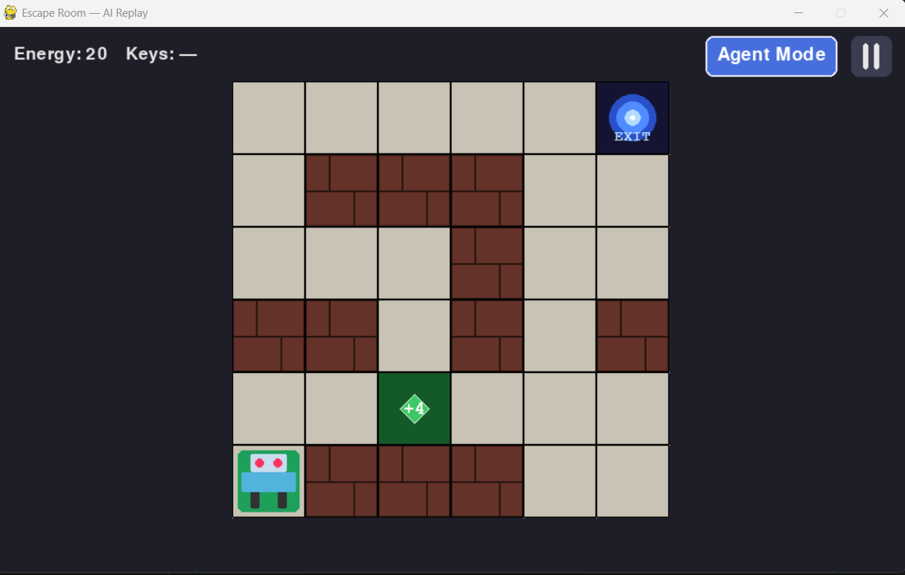
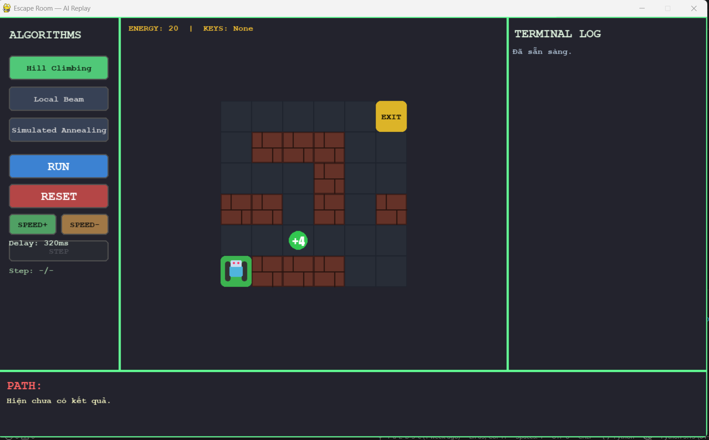
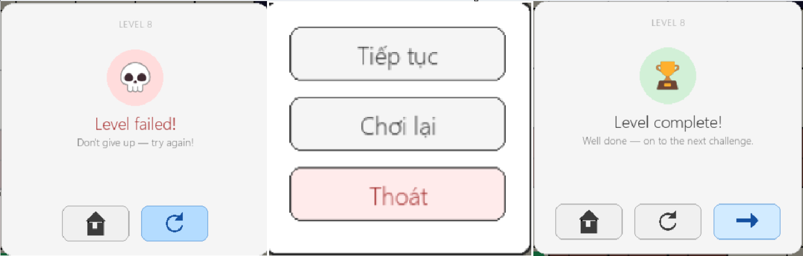

# AI_ARIN330585_Final-Escape_Room_Project

---

## Mục tiêu

 Xây dựng trò chơi **Escape Room**.
     
- Robot phải di chuyển để nhặt năng lượng, chìa khóa để mở cửa phòng và vượt qua được các thử thách trên đường đi (**Sudoku** và **Connect-4**) với mục tiêu của trò chơi là di chuyển robot để thoát khỏi căn phòng.
- Có **Agent mode** áp dụng các thuật toán tìm kiếm để tự động tìm ra đường đi cho robot.
- Xây dựng phần **Giao diện GUI** bằng thư viện `pygame` để người chơi tự chơi hoặc xem cách Agent giải.

---

## Cấu trúc dự án

Cấu trúc tổng quát của dự án:
```
AI_ARIN330585_Final-Escape_Room_Project/
├── algorithms/       # Xây dựng các thuật toán
├── data/             # helper và assets dùng trong phần giao diện và khởi tạo đầu vào của các level
├── screen/           # Bao gồm các cửa sổ giao diện phục vụ các chức năng khác nhau. 
└── Main.py           # Hàm `Main.py` nơi khởi tạo bắt đầu trò chơi.
```

Chi tiết như sau:

### 1. algorithms/
Mỗi thuật toán được xây dựng trong một file `.py` để dễ quản lý và mở rộng. 

```
algorithms/
├── a_star.py
├── alpha_beta_search.py
├── and_or.py
├── backtracking_and_ac_3.py
├── backtracking_and_forwardcheck.py
├── breadth_first_search.py
├── depth_first_search.py
├── expectimax.py
├── greedy_search.py
├── helper.py                 # helper phụ trợ định nghĩa Node, Class, các hàm dùng chung cho các thuật toán.
├── ida.py
├── local_beam.py
├── min_conflict.py
├── minimax_search.py
├── partial_observation.py
├── sensorless_bfs_version.py
├── simple_hill_climbing.py
├── simulated_annealing.py
└── ucs.py
```

### 2. screen/
Chứa các file xây dựng cửa sổ giao diện bằng thư viện `pygame` cho từng mục đích và level cụ thể.
```
screen/
├── __init__.py
├── and_or_solution.py
├── connect_4.py
├── draw_helpers.py
├── failure.py
├── levels_agent_mode.py
├── menu_level.py
├── play.py
├── resume.py
├── sensorless_screen.py
├── start.py
└── success.py
```

### 3. data/
Phụ trợ cho giao diện tổng thể, xây dựng `icons/` chứa các icon và `levels/` chứ đầu vào mỗi level dưới dạng các file **.json** để đồng bộ và mở rộng dễ dàng.

---

## Môi trường sử dụng 

* **Python:** Phiên bản `3.13.x`.
* **IDE/Code Editor:** VS Code.
* **Pygame** Phiên bản Pygame CE (Community Edition) với đặc điểm được open-source, tương thích nhiều thiết bị và được cộng đồng duy trì từ thư viện Pygame gốc.

---

## Hướng dẫn sử dụng

### Bước 1: Tải dự án về máy

```bash
git clone https://github.com/BM910/AI_ARIN330585_Final-Escape_Room_Project.git
cd AI_ARIN330585_Final-Escape_Room_Project
```

### Bước 2: Khởi động môi trường

Cài đặt **Pygame CE (Community Edition)**.

```bash
pip install pygame-ce
```

### Bước 3: Chạy dự án

```bash
python Main.py
```

---

## Các thuật toán đã triển khai

### 1. Tìm kiếm mù (Uninformed search) 
- **Breadth First Search**: Thuật toán BFS (tìm kiếm theo chiều rộng) cách tiếp cận 2.
- **Depth First Search**: Thuật toán DFS (tìm kiếm theo chiều sâu) cách tiếp cận 2.
- **Uniform Cost Search**: Thuật toán UCS với g(n) = g(parent) + energy hao phí trên mỗi bước đi.

### 2. Tìm kiếm có thông tin (Informed search)
- **Greedy Search**: Thuật toán Greedy tìm kiếm bằng cách chọn bước đi có heuristic bé nhất với h(n) = khoảng cách Manhattan từ Robot đến đích.
- **A\***: Thuật toán A* tìm kiếm dựa trên chi phí thực tế kết hợp với hàm khoảng cách ước lượng (heuristic), với  g(n) = g(parent) + energy hao phí trên mỗi bước và h(n) = khoảng cách Manhattan từ Robot đến đích.
- **IDA\***: Thuật toán IDA* là sự kết hợp giữa IDS và A*, giúp tìm kiếm theo A* nhưng theo từng mức f(n).

### 3. Tìm kiếm cục bộ (Local Search)
Các thuật toán trong nhóm này cài đặt h(n) = Khoảng cách Manhattan từ Robot đến cửa đích.
- **Simple Hill Climbing**: Thuật toán leo đồi đơn giản tối ưu hóa cục bộ bằng cách chọn trạng thái tốt hơn đầu tiên được tìm thấy để di chuyển tiếp.
- **Local Beam Search**: Xây dựng thuật toán Local Beam Search với k tùy ý (trong dự án k = 2)
- **Simulated Annealing**: Xây dựng thuật toán Mô phỏng luyện kim với T0 = 100, Tmin = 1 và alpha = 0.97
 
### 4. Tìm kiếm môi trường phức tạp (Complex Environment)
- **Sensorless**: Xây dựng Sensorless Search dựa trên thuật toán BFS cách tiếp cận 2 với đầu vào chỉ biết Goal.
- **Partially Observable**: Xây dựng Tìm kiếm trong môi trường nhìn thấy 1 phần với map mù chỉ nhìn thấy được map 3x3 xung quanh, Agent phải tự khám phá để tìm bước đi.
- **And-Or Search**: Xây dựng thuật toán And-Or Search dùng trong môi trường Không xác định với các ô bị lỗi sinh ra các trạng thái không đúng với di chuyển.

### 5. Tìm kiếm thỏa mãn ràng buộc (CSP)
Các thuật toán này được áp dụng để giải Thử thách **Sudoku** trên đường Agent di chuyển.
- **Forward Checking Search**: Xây dựng thuật toán Forward Checking cho Sudoku, là biến thể của Backtrack bằng việc giảm domain của các biến chưa gán nhãn.
- **AC-3 + Backtracking**:  Xây dựng thuật toán Ac-3 giúp thu hẹp domain dựa vào ràng buộc cung và dùng Domain kết quả thu được cho Sudoku bằng thuật toán Bactracking.
- **Min-conflicts**: Xây dựng thuật toán Min-conflicts cho Sudoku, với max_steps được truyền vào.

**6. Tìm kiếm đối kháng (Adversarial search)** 
Các thuật toán này được áp dụng để giải Thử thách **Connect-4** trên đường Agent di chuyển.
- **Minimax Search**: Xây dựng thuật toán Minimax Search tìm bước đi tối ưu bằng cách giả định đối thủ luôn đi nước cờ tốt nhất.
- **Alpha-Beta Search**: Xây dựng thuật toán Alpha-Beta Search giống như Minimax nhưng có thêm điều kiện cắt tỉa.
- **ExpectiMax Search**: Xây dựng thuật toán ExpectiMax Search, lựa chọn bước đi tối ưu có yếu tố may rủi bằng cách tính giá trị trung bình.

---

## Kết quả thu được  

**Cửa sổ giao diện bắt đầu**

<div align="center">
  
</div>

**Chọn level:** 

<div align="center">
  
</div>

- **Level 1:** Tìm kiếm mù (Uninformed search) 
<div align="center">
  
</div>
 
**Agent Mode** Phần Agent Mode này tương tự cho Level 1, 2, 3 nhưng chỉ khác ở các thuật toán đầu vào cho phù hợp với nhóm thuật toán.
  + Bên phải: Setting và control panel.
  + Giữa: Map chơi.
  + Bên trái: Log panel.
  + Phía dưới: Chuỗi kết quả tìm được.

<div align="center">
  
</div>

- **Level 2:** Tìm kiếm có thông tin (Informed search)
<div align="center">
  
</div>
 
**Agent Mode** 
<div align="center">
  
</div>

- **Level 3:** Tìm kiếm cục bộ (Local search)
<div align="center">
  
</div>
 
**Agent Mode** 
<div align="center">
  
</div>

- **Level 4:** Tìm kiếm môi trường nhìn thấy 1 phần
<div align="center">
  
</div>

- **Level 5:** Tìm kiếm môi trường không nhìn thấy
<div align="center">
  
</div>

- **Level 6:** Tìm kiếm môi trường phức tạp
<div align="center">
  
</div>

- **Level 7:** Tìm kiếm thỏa mãn ràng buộc (CSP) - Trò chơi Sudoku
<div align="center">
  
</div>

- **Level 8:** Tìm kiếm đối kháng (Adversarial search) - Trò chơi Connect-4

<div align="center">
  
</div>

- **Các cửa sổ phụ trợ**
<div align="center">
  
</div>

---

## Nhóm tác giả

|Họ và tên|MSSV|GitHub Profile|
| :--- | :--- | :--- |
|Phan Nguyễn Quốc Hoàng|24110219|[@quochoang](https://github.com/1-a-2-b-3-c)|
|Phạm Trần Đức Lương|24110281|[@ducluong](https://github.com/Duc-Luong060106)|
|Bùi Đặng Pháp Lý|24110283|[@phaply](https://github.com/BM910)|
